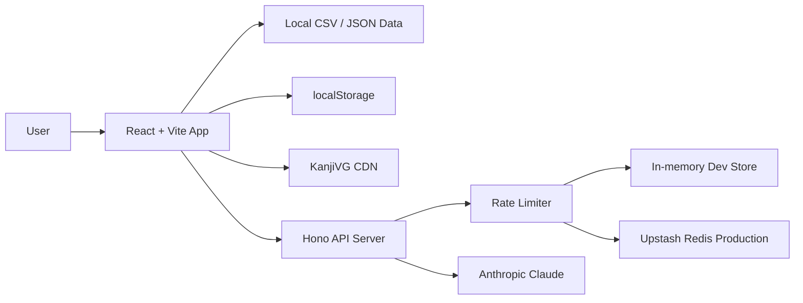

# Kanji App For JLPT


Aplikasi belajar kanji JLPT berbasis React yang membantu learner membuat sesi latihan singkat, memilih kanji, mengambil vocabulary, lalu membuat quiz reading berbasis AI. Project ini saya buat sebagai study tool yang praktis sekaligus portofolio untuk menunjukkan kemampuan membangun frontend interaktif, API lokal, integrasi AI, data processing, persistence, dan testing.

## Ringkasan

Kanji App For JLPT mengubah data kanji dan vocabulary lokal menjadi pengalaman belajar yang lebih terarah:

- Pilih level JLPT N5 sampai N1.
- Pilih maksimal 10 kanji untuk satu deck latihan.
- Ambil vocabulary random dari kanji pilihan.
- Generate quiz reading kanji berbasis konteks kalimat Jepang.
- Latihan ulang dengan flashcard, progres, statistik, dan review.

Dataset saat ini berisi **2.211 kanji** dan sekitar **8.506 vocabulary per bahasa** untuk Bahasa Indonesia dan English.

## Fitur Utama

- **JLPT kanji browser**: jelajahi kanji N5, N4, N3, N2, dan N1 dari data JSON lokal.
- **Focused study deck**: pilih sampai 10 kanji agar sesi belajar tetap kecil dan fokus.
- **Bilingual vocabulary**: arti vocabulary bisa mengikuti pilihan Bahasa Indonesia atau English.
- **Search dan sorting**: cari kanji berdasarkan karakter, arti, on-yomi, atau kun-yomi, lalu urutkan berdasarkan default, frekuensi, atau grade.
- **Random vocab picker**: ambil sampai 3 vocabulary per kanji dengan preferensi level JLPT.
- **AI reading quiz**: buat 10 soal pilihan ganda untuk membaca vocabulary kanji di dalam kalimat Jepang menggunakan Anthropic Claude.
- **Model picker**: pilih Sonnet, Opus, atau Haiku untuk menyesuaikan kualitas dan kecepatan quiz.
- **Quiz cache lokal**: hasil quiz yang sama disimpan sementara di browser agar tidak selalu memanggil API.
- **Flashcard mode**: latihan cepat dengan kartu bolak-balik, audio Jepang, dan pencatatan hasil.
- **Progress dan statistik**: simpan status kanji, akurasi quiz, streak harian, riwayat sesi, export, dan import progres.
- **Stroke order dan breakdown kanji**: ambil animasi goresan dan komponen kanji dari KanjiVG.
- **PWA support**: manifest, icon, dan service worker untuk app shell caching.
- **Dark/light theme**: preferensi tema disimpan di browser.

## Highlight Teknis

Project ini tidak hanya menampilkan UI, tetapi juga memperhatikan fondasi engineering:

- **React 19 + Vite 7** untuk frontend yang ringan dan cepat.
- **Hono + Node.js** untuk API lokal yang menangani health check, versioning, CORS, rate limit, dan quiz generation.
- **Prompt validation** di server agar Claude hanya memakai vocabulary yang dipilih user, bukan mengarang target kata atau reading.
- **Rate limiting** 10 request per menit per IP, dengan fallback in-memory untuk development dan Upstash Redis untuk production/serverless.
- **Local persistence** menggunakan `localStorage` untuk bahasa, tema, model AI, progress, statistik, dan quiz cache.
- **SVG sanitization** sebelum menampilkan data eksternal dari KanjiVG.
- **Unit test** untuk parsing CSV, normalisasi kanji/vocab, quiz payload, formatting, dan rate limiter.
- **Coverage threshold** di Vitest untuk menjaga kualitas utility penting.

## Arsitektur Singkat



## Tech Stack

| Area | Teknologi |
| --- | --- |
| Frontend | React 19, Vite 7, CSS custom properties |
| Backend API | Node.js, Hono, `@hono/node-server` |
| AI | Anthropic SDK |
| Data | JSON kanji, CSV vocabulary, preprocessing notebook |
| Persistence | `localStorage`, browser cache, service worker |
| Rate limit | In-memory limiter, Upstash Redis optional |
| Testing | Vitest, V8 coverage |

## Cara Menjalankan

### Kebutuhan

- Node.js `20.19.0` atau lebih baru, atau Node.js `22.12.0` atau lebih baru.
- npm.
- Anthropic API key untuk fitur generate quiz AI.

### Install dependency

```bash
npm install
```

### Konfigurasi environment

Buat file `.env` di root project:

```bash
ANTHROPIC_API_KEY=your_anthropic_api_key_here
```

File `.env` berisi secret pribadi, jadi jangan dicommit.

### Jalankan API server

```bash
npm run api
```

Default API berjalan di:

```text
http://127.0.0.1:8787
```

### Jalankan frontend

Buka terminal kedua, lalu jalankan:

```bash
npm run dev
```

Buka app di browser:

```text
http://127.0.0.1:5173
```

Vite akan meneruskan request `/api` ke `http://127.0.0.1:8787`.

## Environment Variables

| Name | Required | Default | Keterangan |
| --- | --- | --- | --- |
| `ANTHROPIC_API_KEY` | Ya, untuk quiz AI | - | API key Anthropic untuk generate quiz. |
| `ANTHROPIC_MODEL` | Tidak | `claude-sonnet-4-20250514` | Default model Claude. |
| `HOST` | Tidak | `127.0.0.1` | Host API server lokal. |
| `PORT` | Tidak | `8787` | Port API server lokal. |
| `APP_ORIGIN` | Tidak | `http://127.0.0.1:5173` | Origin frontend yang diizinkan oleh CORS. |
| `UPSTASH_REDIS_REST_URL` | Tidak | - | Redis REST URL untuk rate limit production. |
| `UPSTASH_REDIS_REST_TOKEN` | Tidak | - | Redis REST token untuk rate limit production. |

Model yang didukung oleh app:

- `claude-sonnet-4-20250514`
- `claude-opus-4-1-20250805`
- `claude-3-5-haiku-20241022`

## NPM Scripts

| Script | Fungsi |
| --- | --- |
| `npm run dev` | Menjalankan frontend Vite. |
| `npm run api` | Menjalankan API server Hono. |
| `npm run build` | Membuat production build. |
| `npm run preview` | Preview hasil build secara lokal. |
| `npm test` | Menjalankan unit test sekali. |
| `npm run test:watch` | Menjalankan Vitest watch mode. |
| `npm run test:coverage` | Menjalankan test dengan laporan coverage. |

## API Endpoint

| Method | Endpoint | Fungsi |
| --- | --- | --- |
| `GET` | `/api/health` | Mengecek status API, API key, default model, dan supported models. |
| `GET` | `/api/version` | Mengembalikan nama API, versi package, dan model aktif. |
| `POST` | `/api/generate-reading-quiz` | Generate quiz reading kanji dari deck vocabulary yang dipilih user. |

Endpoint quiz memiliki proteksi rate limit **10 request per menit per IP**.

## Testing

Jalankan semua test:

```bash
npm test
```

Jalankan coverage:

```bash
npm run test:coverage
```

Test yang tersedia mencakup:

- Parsing CSV vocabulary.
- Normalisasi data kanji dan vocabulary.
- Pembuatan payload quiz untuk LLM.
- Formatting teks multi-bahasa.
- Rate limiter untuk API quiz.

## Struktur Project

```text
Data/
  Kanji/                 Data kanji JLPT dalam format JSON
  Vocabulary/            Data vocabulary CSV
    English/             Vocabulary dengan arti English
    Indonesian/          Vocabulary dengan arti Bahasa Indonesia
Preprocessing/           Notebook untuk preprocessing dan translasi data
public/                  Manifest, service worker, dan icon PWA
server/                  API Hono untuk generate quiz dan rate limit
src/
  components/            UI utama, modal, quiz, flashcard, statistik
  hooks/                 State, persistence, progress, quiz cache
  styles/                Design tokens
  __tests__/             Unit test frontend utilities
```

## Deployment Notes

Frontend dapat dibuild dengan:

```bash
npm run build
```

Untuk deployment serverless, jangan mengandalkan rate limit in-memory karena state bisa hilang antar cold start. Set `UPSTASH_REDIS_REST_URL` dan `UPSTASH_REDIS_REST_TOKEN` agar rate limit memakai shared store.

Fitur quiz AI membutuhkan koneksi ke API server dan `ANTHROPIC_API_KEY`. Fitur browse kanji, vocabulary, flashcard, progress lokal, dan PWA app shell tetap berbasis data lokal/browser.

## Pengembangan Berikutnya

- Menambahkan live demo production.
- Menambah mode review otomatis berdasarkan jadwal SRS.
- Menambah visualisasi progres yang lebih detail per kanji.
- Menambah opsi cloud sync untuk progres belajar.
- Memperluas dukungan bahasa selain Indonesia dan English.

## Author

Muhammad Dani Nasution

- LinkedIn: [muhammad-dani-nasution](https://www.linkedin.com/in/muhammad-dani-nasution)
- Instagram: [@danasty29](https://www.instagram.com/danasty29)
